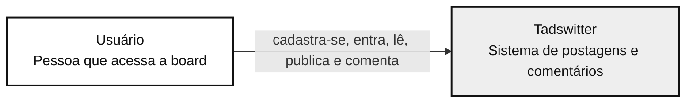
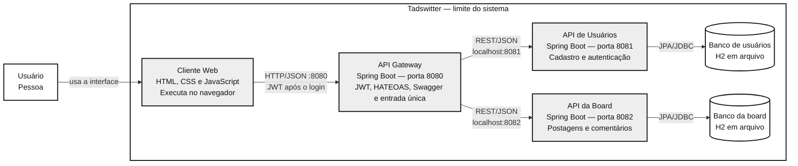

# Diagramas C4 — Tadswitter

Estes dois diagramas mostram a arquitetura implementada no projeto. Abra este arquivo em um visualizador de Markdown com suporte a Mermaid para exibir os desenhos.

## Nível 1 — Contexto do sistema

**Pergunta respondida:** quem usa o Tadswitter e para quê?

O projeto não depende de sistemas externos. Swagger, JWT e bancos de dados são detalhes internos e por isso aparecem apenas no nível 2 ou na explicação técnica.

**Fala sugerida:** “O Tadswitter é uma board. O usuário cria uma conta, entra, lê postagens, publica uma postagem com título e mensagem e comenta em uma postagem.”

## Nível 2 — Contêineres

**Pergunta respondida:** quais aplicações e bancos formam o Tadswitter e como se comunicam?

**Fala sugerida:** “O cliente web roda no navegador e é servido pelo Gateway. O navegador chama somente o Gateway na porta 8080. Ele valida o JWT nas rotas protegidas, acrescenta links HATEOAS às respostas e publica o Swagger. Para cumprir as operações, o Gateway chama duas APIs internas por HTTP. A API de usuários cuida de cadastro e login; a API da board cuida de postagens e comentários. Cada uma tem seu próprio banco H2. As duas APIs internas escutam apenas em `127.0.0.1`; na apresentação, só a porta 8080 precisa ser acessada pela outra máquina.”

### Como relacionar o desenho ao código

| Caixa no nível 2 | Pasta do projeto |
| --- | --- |
| Cliente Web | `gateway/src/main/resources/static` |
| API Gateway | `gateway/src/main/java/gateway` |
| API de Usuários | `usuarios-api/src/main/java/usuarios` |
| API da Board | `board-api/src/main/java/board` |
| Bancos H2 | Arquivos gerados em `dados/` ao iniciar o sistema |

As pastas `controller`, `service`, `repository` e `model` são partes internas de cada aplicação. Elas não são contêineres separados no C4 nível 2.

Referência: [C4 — contexto do sistema](https://c4model.com/diagrams/system-context) e [C4 — contêineres](https://c4model.com/diagrams/container).
